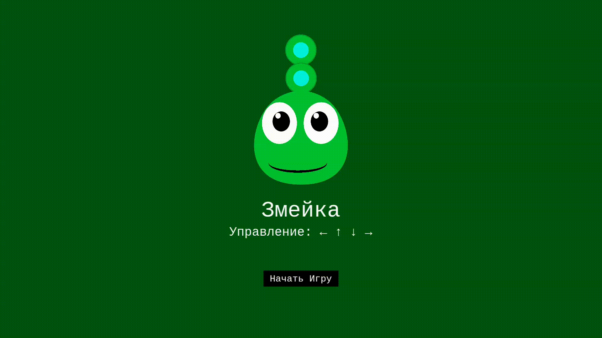

# Snake

## Описание проекта

Snake — классическая игровая аркада, реализованная в веб-интерфейсе, где игроку предстоит управлять змейкой, собирать бонусы и расти, избегая столкновений с границами игрового поля.

## Технологический стек

* **Фреймворк:** Phaser 3.90.0
* **Язык:** TypeScript
* **Анимации:** Tween.js (встроенный в Phaser) для реализации анимаций.

## Демонстрация

[Ссылка на игру](https://yaroslav20568.github.io/snake-phaser/)

# Snake

## Project Description

Snake — classic arcade game, implemented in a web interface, where the player must control a snake, collect bonuses, and grow while avoiding collisions with the boundaries of the playing field.

## Tech Stack

* **Framework:** Phaser 3.90.0
* **Language:** TypeScript
* **Animations:** Tween.js (built into Phaser) for animations.

## Demo

[Game link](https://yaroslav20568.github.io/snake-phaser/)

